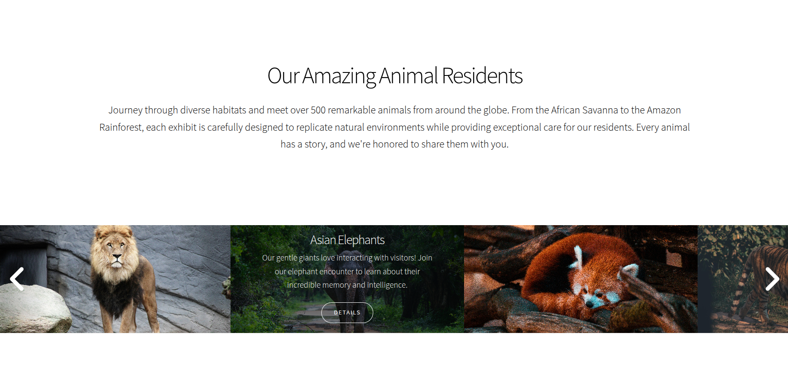

<!-- 🦁 🐯 🐵 Zoo Showcase README.md -->

# 🦓 Zoo Showcase



🔗 **Live website:** https://zoo-showcase.vercel.app/  
🎥 **YouTube video showcase:** https://www.youtube.com/watch?v=8EbAtxbNooA

---

## 🧠 Project Overview

**Zoo Showcase** 🐾 is a clean, modern, and responsive static website designed to present a zoo-themed project, animal collection, or promotional showcase.  
It focuses on simplicity, performance, and visual appeal, making it ideal as a landing page or demo site.

The project is built using standard web technologies and is optimized for static hosting platforms like **Vercel**.

---

## 🚀 Features

✨ Responsive layout for all screen sizes  
🎨 Modern and clean UI design  
⚡ Lightweight and fast loading  
🧩 Easy to customize content and styles  
🌍 Ready for static hosting and deployment  

---

## 🗂️ Project Structure

```text
├── assets/
│   ├── css/        # Stylesheets
│   ├── js/         # JavaScript files
│   └── images/     # Image assets (including zoo.png)
├── index.html      # Main landing page
├── index-demo.html # Demo version (if included)
├── privacy-policy.html
├── README.md
├── LICENSE
└── ...

## 🛠️ Getting Started

### Clone the repository

```bash
git clone https://github.com/raimonvibe/zoo-showcase.git

### Run locally

Open `index.html` directly in your browser  
**or** use a local development server (recommended):

```bash
npx live-server
```

This will start a local server and automatically open the project in your browser with live reload enabled.

This will start a local server and automatically open the project in your browser with live reload enabled.

---

## 🚀 Deployment

This project is a fully static website and can be deployed easily using popular hosting platforms:

- **Vercel** (recommended)
- **Netlify**
- **GitHub Pages**
- Any other static hosting provider

Simply connect the repository to your hosting service and follow their deployment instructions.

---

## 🤝 Contributing

Contributions are welcome!  
If you have ideas, improvements, or bug fixes, feel free to open an issue or submit a pull request.

---

## 📄 License

This project is licensed under the **MIT License**.  
See the `LICENSE` file for more information.

---

## 🐾 Final Notes

Enjoy building and customizing **Zoo Showcase** 🦓  
Have fun experimenting, learning, and creating something wild 🌿🦒


